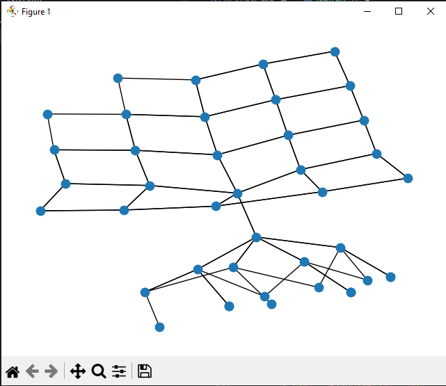

# Лабораторная работа 8

Дисциплина: Искусственный интеллект  
Тема: Поиск в пространстве состояний. Многошаговое планирование для среды с несколькими объектами  

Студент: Maximenco Stanislav
Группа: I2302  

## Цель работы

Изучить методы поиска в пространстве состояний для задач с несколькими объектами в сеточной среде, где требуется многошаговое планирование. Реализовать слепые и информированные алгоритмы поиска, а также построить граф достижимых состояний.

## Описание среды и формализация задачи

Рассматривается робот, который перемещается по клеткам квадратной сетки и взаимодействует с двумя объектами A и B. Робот может:

- перемещаться на одну клетку вверх, вниз, влево или вправо  
- поднимать объект, если находится с ним на одной клетке  
- переносить один объект за раз  
- класть объект на текущую клетку

Состояние описывается пятеркой:

- rx, ry  координаты робота  
- posA    координаты объекта A или строка `"carried"`  
- posB    координаты объекта B или строка `"carried"`  
- carrying  принимает значения `None`, `"A"` или `"B"`

Начальное состояние в программе:

- robot = (0, 0)  
- A = (1, 2)  
- B = (3, 4)  
- carrying = None  

Целевое состояние задается одной целевой позицией для обоих объектов:

- GOAL_POS = (4, 0)  
- posA = GOAL_POS  
- posB = GOAL_POS  
- carrying = None  

Каждое действие имеет стоимость 1.

## Операторы переходов

Действия робота:

1. Вверх, если `ry > 0`: новое положение `(rx, ry - 1)`  
2. Вниз, если `ry < GRID - 1`: новое положение `(rx, ry + 1)`  
3. Влево, если `rx > 0`: новое положение `(rx - 1, ry)`  
4. Вправо, если `rx < GRID - 1`: новое положение `(rx + 1, ry)`  
5. Поднять A, если `robot == posA` и `carrying is None`: `posA = "carried"`, `carrying = "A"`  
6. Поднять B, если `robot == posB` и `carrying is None`: `posB = "carried"`, `carrying = "B"`  
7. Положить A, если `carrying == "A"`: `posA = robot`, `carrying = None`  
8. Положить B, если `carrying == "B"`: `posB = robot`, `carrying = None`  

## Реализованные алгоритмы поиска

В программе реализованы и сравниваются:

- Forward BFS  прямой поиск в ширину от начального состояния к цели  
- Forward A*  прямой эвристический поиск  
- Backward BFS  обратный поиск в ширину от цели к началу  
- Backward A*  обратный A*  
- Bidirectional BFS  двунаправленный поиск

Эвристика для прямого A* основана на манхэттенском расстоянии от объектов и робота до целевой позиции.

## Код программы (lab8.py)

```csharp
import time
from collections import deque
import heapq
import networkx as nx
import matplotlib.pyplot as plt

GRID = 5
GOAL_POS = (4, 0)


# состояние: (rx, ry, posA, posB, carrying)
# posA/posB = (x, y) или "carried"


def initial_state():
    return (0, 0, (1, 2), (3, 4), None)


def is_goal(s):
    _, _, posA, posB, _ = s
    return posA == GOAL_POS and posB == GOAL_POS


# ===== СОСЕДИ =====


def neighbors(state):
    rx, ry, posA, posB, carrying = state
    res = []

    # движения
    for dx, dy in [(-1, 0), (1, 0), (0, -1), (0, 1)]:
        nx_, ny_ = rx + dx, ry + dy
        if 0 <= nx_ < GRID and 0 <= ny_ < GRID:
            res.append((nx_, ny_, posA, posB, carrying))

    # поднять объект
    if carrying is None:
        if isinstance(posA, tuple) and posA == (rx, ry):
            res.append((rx, ry, "carried", posB, "A"))
        if isinstance(posB, tuple) and posB == (rx, ry):
            res.append((rx, ry, posA, "carried", "B"))

    # положить объект
    if carrying == "A":
        res.append((rx, ry, (rx, ry), posB, None))
    if carrying == "B":
        res.append((rx, ry, posA, (rx, ry), None))

    return res


# ===== МАНХЭТТЕН =====


def manhattan(a, b):
    return abs(a[0] - b[0]) + abs(a[1] - b[1])


# ===== ЭВРИСТИКИ =====


def h_forward(s):
    rx, ry, posA, posB, _ = s
    h = 0
    if isinstance(posA, tuple):
        h += manhattan(posA, GOAL_POS)
    if isinstance(posB, tuple):
        h += manhattan(posB, GOAL_POS)
    h += min(
        manhattan((rx, ry), posA if isinstance(posA, tuple) else GOAL_POS),
        manhattan((rx, ry), posB if isinstance(posB, tuple) else GOAL_POS),
    )
    return h


def h_backward(s, start):
    rx, ry, posA, posB, _ = s
    srx, sry, sA, sB, _ = start

    h = manhattan((rx, ry), (srx, sry))
    if isinstance(posA, tuple) and isinstance(sA, tuple):
        h += manhattan(posA, sA)
    if isinstance(posB, tuple) and isinstance(sB, tuple):
        h += manhattan(posB, sB)

    return h


# ===== BFS =====


def bfs(start, goal_check):
    t0 = time.time()
    q = deque([start])
    parent = {start: None}
    visited = 0

    while q:
        cur = q.popleft()
        visited += 1

        if goal_check(cur):
            path = []
            while cur is not None:
                path.append(cur)
                cur = parent[cur]
            path.reverse()
            return path, visited, time.time() - t0

        for nxt in neighbors(cur):
            if nxt not in parent:
                parent[nxt] = cur
                q.append(nxt)

    return None, visited, time.time() - t0


# ===== A* =====


def astar(start, goal_check, h_func):
    t0 = time.time()
    pq = []
    counter = 0
    heapq.heappush(pq, (0, counter, start))

    parent = {start: None}
    g = {start: 0}
    visited = 0

    while pq:
        _, _, cur = heapq.heappop(pq)
        visited += 1

        if goal_check(cur):
            path = []
            while cur is not None:
                path.append(cur)
                cur = parent[cur]
            path.reverse()
            return path, visited, time.time() - t0

        for nxt in neighbors(cur):
            new_g = g[cur] + 1
            if nxt not in g or new_g < g[nxt]:
                g[nxt] = new_g
                counter += 1
                f = new_g + h_func(nxt)
                parent[nxt] = cur
                heapq.heappush(pq, (f, counter, nxt))

    return None, visited, time.time() - t0


# ===== ДВУНАПРАВЛЕННЫЙ BFS =====


def bidirectional(start, goal):
    if start == goal:
        return [start], 1, 0.0

    t0 = time.time()

    front1 = {start: None}
    front2 = {goal: None}

    q1 = deque([start])
    q2 = deque([goal])

    visited = 0
    meet = None

    while q1 and q2:
        # расширение из start
        cur = q1.popleft()
        visited += 1
        for nxt in neighbors(cur):
            if nxt not in front1:
                front1[nxt] = cur
                q1.append(nxt)
                if nxt in front2:
                    meet = nxt
                    break
        if meet:
            break

        # расширение из goal
        cur = q2.popleft()
        visited += 1
        for nxt in neighbors(cur):
            if nxt not in front2:
                front2[nxt] = cur
                q2.append(nxt)
                if nxt in front1:
                    meet = nxt
                    break
        if meet:
            break

    if not meet:
        return None, visited, time.time() - t0

    # восстановление пути
    path1 = []
    x = meet
    while x is not None:
        path1.append(x)
        x = front1[x]
    path1.reverse()

    path2 = []
    x = front2[meet]
    while x is not None:
        path2.append(x)
        x = front2[x]

    path = path1 + path2
    return path, visited, time.time() - t0


# ===== ГРАФ СОСТОЯНИЙ =====


def build_graph(start, limit=40):
    G = nx.DiGraph()
    q = deque([start])
    seen = {start}
    cnt = 0

    while q and cnt < limit:
        cur = q.popleft()
        for nxt in neighbors(cur):
            G.add_edge(cur, nxt)
            if nxt not in seen:
                seen.add(nxt)
                q.append(nxt)
                cnt += 1
                if cnt >= limit:
                    break
    return G


def main():
    start = initial_state()

    print("=== FORWARD BFS ===")
    path, vis, t = bfs(start, is_goal)
    print("steps:", len(path) - 1, "visited:", vis, "time:", t)

    print("=== FORWARD A* ===")
    path2, vis2, t2 = astar(start, is_goal, lambda s: h_forward(s))
    print("steps:", len(path2) - 1, "visited:", vis2, "time:", t2)

    goal = path[-1]

    print("=== BACKWARD BFS ===")
    path3, vis3, t3 = bfs(goal, lambda s: s == start)
    print("steps:", len(path3) - 1, "visited:", vis3, "time:", t3)

    print("=== BACKWARD A* ===")
    path4, vis4, t4 = astar(goal, lambda s: s == start, lambda s: h_backward(s, start))
    print("steps:", len(path4) - 1, "visited:", vis4, "time:", t4)

    print("=== BIDIRECTIONAL BFS ===")
    path5, vis5, t5 = bidirectional(start, goal)
    print("steps:", len(path5) - 1, "visited:", vis5, "time:", t5)

    print("=== GRAPH BUILD ===")
    G = build_graph(start)
    pos = nx.kamada_kawai_layout(G)
    nx.draw(G, pos, with_labels=False, node_size=80, arrows=False)
    plt.show()


if __name__ == "__main__":
    main()
```

## Результаты экспериментов

По отчету были получены следующие показатели:

- Forward BFS: 22 шага, около 13858 посещенных состояний, время примерно 0.026 с  
- Forward A*: 22 шага, около 1199 состояний, время примерно 0.006 с  
- Backward BFS: 22 шага, около 14180 состояний, время примерно 0.024 с  
- Backward A*: 22 шага, около 2920 состояний, время примерно 0.012 с  
- Bidirectional BFS: 22 шага, около 1150 состояний, время примерно 0.002 с  

Двунаправленный поиск показал наилучшее сочетание скорости и числа просмотренных состояний. Эвристика значительно ускорила A* по сравнению с обычным BFS.

## Выводы

В работе было разработано пространство состояний для робота с двумя объектами на сетке и реализованы несколько стратегий поиска: BFS, A*, обратный поиск и двунаправленный поиск. Проведенный анализ показал:

- слепые методы (BFS) требуют просмотра большого числа состояний  
- эвристический поиск A* сильно снижает количество посещенных узлов  
- двунаправленный BFS оказался самым быстрым вариантом  
- выбор эвристики влияет на эффективность, особенно в прямом и обратном вариантах задачи  

Цель лабораторной работы выполнена, алгоритмы реализованы и сравнены, граф достижимых состояний построен и визуализирован.




